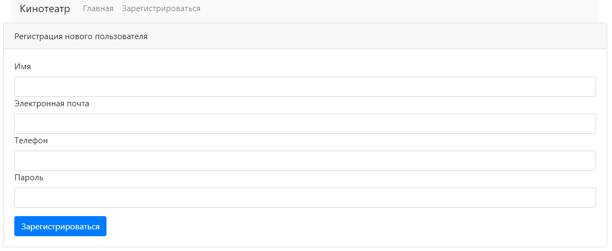

# job4j_cinema

## Описание проекта
Данный проект представляет собой реализацию сайта для покупки билетов в кинотеатр.  
Есть администраторы и пользователи.  
Администраторы могут добавлять сеансы, а пользователи могут покупать билеты на сеанс.  
Реализованный функционал:
* если весь ряд уже занят, то он не будет показываться в списке доступных рядов;
* если место уже занято, то оно не будет показываться в списке доступных мест;
* если параллельно кто-то уже выкупил место, то при попытке купить билет высветится сообщение об ошибке.

## Стек технологий
* Java 17
* PostgreSQL 14
* Apache Maven 3.8.5
* Spring Boot 2.7.2
* Liquibase 4.15.0
* Log4j 1.2.17
* Checkstyle 8.29
* Thymeleaf 3.0.15

## Требуемое окружение для запуска проекта
* Браузер
* JDK 17
* Apache Maven 3.8
* PostgreSQL 14
* Docker

## Инструкция по запуску проекта
### Используя Docker – выполнить команды
1)  `git clone https://github.com/denfort50/job4j_cinema`
2) `cd job4j_cinema`
3) `mvn install`
4) `docker build -t job4j_cinema .`
5) `docker-compose up`

### Не используя Docker
1) Скачать и разархивировать проект
2) В PostgreSQL создать базу данных cinema (url = `jdbc:postgresql://127.0.0.1:5432/cinema`)
3) Открыть командную строку и перейти в папку с проектом, например `cd c:\projects\job4j_cinema`
4) Выполнить команду `mvn install`
5) Перейти в папку target командой `cd target`
6) Выполнить команду `java -jar job4j_cinema-1.0.jar`
7) Перейти по ссылке `http://localhost:8081/mainPage`

## Взаимодействие с приложением

### При открытии сайта попадаем на главную страницу с выбором фильма

### Чтобы была возможность совершать действия, нужно зарегистрироваться

### Если был зарегистрирован пользователь с именем Администратор, то на главной странице появляется кнопка "Добавить сеанс"

### Страница с формой добавления сеансов

### Если был зарегистрирован пользователь с обычным именем, то снова попадаем на главную страницу сайта

### После выбора фильма открывается страница с выбором ряда

### После выбора ряда открывается страница с выбором места

### После выбора места и нажатия кнопки "Купить" попадаем на страницу с информацией о купленном билете

## Контакты для связи
&nbsp;&nbsp;
&nbsp;&nbsp;